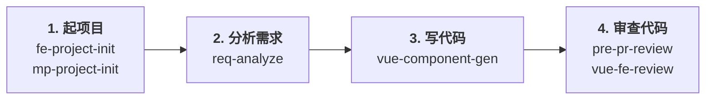

# claude-skills

个人 Agent Skills 仓库，面向 **Vue3 + TypeScript + Nuxt** 与 **uni-app 微信小程序** 的日常开发，按"起项目 → 分析需求 → 写代码 → 审查代码"四阶段组织。同时支持 **Claude Code** 与 **Cursor**。

---

## 工作流总览



**自然口令**：「新建 H5 项目」/「新建小程序」/「分析这个需求」/「写个用户卡片组件」/「提 PR 前审一下」/「review 一下这段代码」。

---

## Skills 详解（按工作顺序）

### 阶段 1 · 起项目

从零搭出能立即跑起来的骨架，问答式收集需求，一口气做完脚手架 / 依赖 / 拦截器 / Layout / 设计纪律 / 注释 / 验证。**两者按端类型分工，互不混用。**

| Skill | 触发 | 适用 | 产出 |
|-------|------|------|------|
| [`fe-project-init`](./fe-project-init) | `/fe-project-init`、"新建 H5 项目"、"从零搭项目" | **PC / 移动 H5** | 10 问(技术栈 / 纯静态或有接口 / PC 自适应等) → Vue3+Vite / Nuxt3 / React / Next 骨架；多域名拦截器；Tailwind 设计纪律(双字族 + brand 十档色阶 + 渐变背景 + 4.5:1 对比度)；可选会员管理 |
| [`mp-project-init`](./mp-project-init) | `/mp-project-init`、"新建小程序" | **微信小程序** | 5 问(方向商城/新闻/视频 + 样式 + 域名 + 会员) → uni-app + Vue3 + Vite + TS 骨架；tabBar + 登录页；envVersion 域名切换；rpx 适配 |

两个 skill 都会在生成的项目里写：
- 关键文件**文件头中文注释**（职责 / 依赖方 / 修改注意点）
- 项目 `README.md` 的**目录导读表**（`pages.json` 等 JSON 文件无法注释的内容统一写在 README）
- 禁止"定义变量""导入路由"类废话注释

### 阶段 2 · 分析需求

拿到一个需求后先判断"这是改页面 / 加功能 / 加组件"中的哪一类，再定位**会改哪些文件**和**会影响到哪些关联模块**。**只读不改代码**。

| Skill | 触发 | 用途 |
|-------|------|------|
| [`req-analyze`](./req-analyze) | `/req-analyze`、"分析这个需求"、"这个需求要改哪里" | 需求落点分析；定位改动文件；分析关联组件与关联功能的影响范围；产出可执行的改动清单（不动代码） |

### 阶段 3 · 写代码

按阶段 2 的分析结果落地组件 / 页面骨架。会自动读项目里的 `config/design.ts`（端 / 单位）和 `config/env.ts`（域名），匹配项目目录约定 / UI 库 / 请求封装。

| Skill | 触发 | 用途 |
|-------|------|------|
| [`vue-component-gen`](./vue-component-gen) | `/vue-component-gen`、"生成组件"、"建一个 xxx 页面"、"写个 xxx 组件" | Vue3 + TS + Nuxt 组件 / 页面骨架；自动套用项目的 UI 库 / 状态库 / 请求封装；移动端按 750 稿 rpx/rem 适配 |

### 阶段 4 · 审查代码

提 PR 前的两道闸门，**都只报告不改代码**、**职责不重叠**：Vue 专项复核走 `vue-fe-review`，安全 + 测试专项走 `pre-pr-review`。两个都跑一遍才能覆盖完整。

| Skill | 触发 | 关注点 |
|-------|------|--------|
| [`vue-fe-review`](./vue-fe-review) | `/vue-fe-review`、"review 一下"、"前端审一下"、"这代码有啥问题" | **Vue 深度专项**：响应式陷阱 / Nuxt SSR 反模式 / 路由硬编码 + 404 核对 / 加载速度 / 内存 / TS 类型完整性 / 错误处理 / 设计纪律（紫色禁用 / 白灰大色块 / 零动效 / 覆盖字体）/ fe-project-init 约定；一轮 + 自省一次后收口 |
| [`pre-pr-review`](./pre-pr-review) | `/pre-pr-review`、"提 PR 前审一下"、"安全审查"、"检查安全性"、"测试覆盖" | **安全 + 测试专项**：注入 / XSS / 敏感信息泄漏 / 开放重定向 / 鉴权绕过 / SSR 私密配置泄漏 / 依赖风险 + 测试与手工验证清单；默认审当前 diff |

两个 skill 在末尾都会提醒对方范围内的疑点（`vue-fe-review` 提到 pre-pr，反之亦然），你可以按需要跑第二次。确认 review 结论后再让 agent「按 review 改」。

---

## 安装

### macOS / Linux

```bash
git clone https://github.com/<your-username>/claude-skills.git ~/claude-skills
cd ~/claude-skills
bash install.sh
```

### Windows (PowerShell)

```powershell
git clone https://github.com/<your-username>/claude-skills.git $HOME\claude-skills
cd $HOME\claude-skills
.\install.ps1
```

安装脚本把每个 skill **软链接**到下表两个目录（同时支持两个工具）：

| 工具 | 路径 |
|------|------|
| Claude Code | `~/.claude/skills/` |
| Cursor | `~/.cursor/skills/` |

已存在的同名目录会自动备份为 `xxx.backup-<时间戳>`。

**仅装其中一个工具**：

```bash
INSTALL_TARGETS="$HOME/.cursor/skills" bash install.sh   # 只装 Cursor
INSTALL_TARGETS="$HOME/.claude/skills" bash install.sh   # 只装 Claude Code
```

---

## 使用

在 Claude Code 或 Cursor 里：

- **斜杠命令**：`/fe-project-init` `/mp-project-init` `/req-analyze` `/vue-component-gen` `/pre-pr-review` `/vue-fe-review`
- **自然语言**：见每个 skill 表格里的"触发"列

安装或更新后**新开 Agent 会话**再使用。

---

## 更新

```bash
cd ~/claude-skills
git pull           # 软链接自动指向新版本
bash install.sh    # 有新 skill 时补链
```

---

## 卸载

```bash
rm ~/.claude/skills/fe-project-init ~/.claude/skills/mp-project-init \
   ~/.claude/skills/req-analyze ~/.claude/skills/vue-component-gen \
   ~/.claude/skills/pre-pr-review ~/.claude/skills/vue-fe-review
rm ~/.cursor/skills/fe-project-init ~/.cursor/skills/mp-project-init \
   ~/.cursor/skills/req-analyze ~/.cursor/skills/vue-component-gen \
   ~/.cursor/skills/pre-pr-review ~/.cursor/skills/vue-fe-review
```

只删软链接，源文件仍在 `~/claude-skills/`。

---

## 添加新 Skill

1. 根目录建 `<skill-name>/SKILL.md`
2. 跑一次 `bash install.sh` 或 `.\install.ps1` 补软链
3. 在本 README "Skills 详解"对应阶段的表格里补一行
4. 如果是新阶段（不属于现有四个），在工作流总览图里也加一栏

---

## License

MIT
